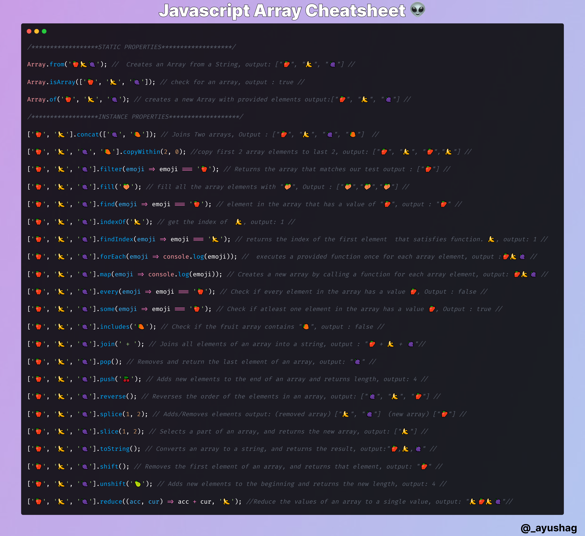

<h1 align="center">
  Javascript Array Cheatsheet👾
</h1>



<h2 align="center">
<a href="Cheatsheet.png" download>Click to download ☝</a>
</h2>

```
/******************STATIC PROPERTIES*******************/

Array.from('🍎🍌🍇'); //  Creates an Array from a String, output: ["🍎", "🍌", "🍇"] //

Array.isArray(['🍎', '🍌', '🍇']); // check for an array, output : true //

Array.of('🍎', '🍌', '🍇'); // creates a new Array with provided elements output:["🍎", "🍌", "🍇"] //

/******************INSTANCE PROPERTIES*******************/

['🍎', '🍌'].concat(['🍇', '🥭']); // Joins Two arrays, Output : ["🍎", "🍌", "🍇", "🥭"]  //

['🍎', '🍌', '🍇', '🥭'].copyWithin(2, 0); //copy first 2 array elements to last 2, output: ["🍎", "🍌", "🍎","🍌"] //

['🍎', '🍌', '🍇'].filter(emoji => emoji === '🍎'); // Returns the array that matches our test output : ["🍎"] //

['🍎', '🍌', '🍇'].fill('🍑'); // fill all the array elements with "🍑", Output : ["🍑","🍑","🍑"] //

['🍎', '🍌', '🍇'].find(emoji => emoji === '🍎'); // element in the array that has a value of "🍎", output : "🍎" //

['🍎', '🍌', '🍇'].indexOf('🍌'); // get the index of  🍌, output: 1 //

['🍎', '🍌', '🍇'].findIndex(emoji => emoji === '🍌'); // returns the index of the first element  that satisfies the provided testing function. 🍌, output: 1 //

['🍎', '🍌', '🍇'].forEach(emoji => console.log(emoji)); //  executes a provided function once for each array element, output :🍎🍌🍇 //

['🍎', '🍌', '🍇'].map(emoji => emoji + 🍒); // Creates a new array by replacing with the return of a function for each array element, output: [🍎🍒, 🍌🍒 , 🍇🍒]

['🍎', '🍌', '🍇'].every(emoji => emoji === '🍎'); // Check if every element in the array has a value 🍎, Output : false //

['🍎', '🍌', '🍇'].some(emoji => emoji === '🍎'); // Check if atleast one element in the array has a value 🍎, Output : true //

['🍎', '🍌', '🍇'].includes('🥭'); // Check if the fruit array contains "🥭", output : false //

['🍎', '🍌', '🍇'].join(' + '); // Joins all elements of an array into a string, output : "🍎 + 🍌 + 🍇"//

['🍎', '🍌', '🍇'].pop(); // Removes and return the last element of an array, output: "🍇" //

['🍎', '🍌', '🍇'].push('🍒'); // Adds new elements to the end of an array and returns length, output: 4 //

['🍎', '🍌', '🍇'].reverse(); // Reverses the order of the elements in an array, output: ["🍇", "🍌", "🍎"] //

['🍎', '🍌', '🍇'].splice(1, 2); // Adds/Removes elements output: (removed array) ["🍌", "🍇"]  (new array) ["🍎"] //

['🍎', '🍌', '🍇'].slice(1, 2); // Selects a part of an array, and returns the new array, output: ["🍌"] //

['🍎', '🍌', '🍇'].toString(); // Converts an array to a string, and returns the result, output:"🍎,🍌,🍇" //

['🍎', '🍌', '🍇'].shift(); // Removes the first element of an array, and returns that element, output: "🍎" //

['🍎', '🍌', '🍇'].unshift('🍐'); // Adds new elements to the beginning and returns the new length, output: 4 //

['🍎', '🍌', '🍇'].reduce((acc, cur) => acc + cur, '🍌'); //Reduce the values of an array to a single value, output: "🍌🍎🍌🍇"//

```


## Important 🚨

There is no way this is perfect or include all the methods. I'll try to fix/add more methods.For Now I have added only that methods that I knew about. Thanks for sparing your time and  dropping by. Drop a star if this helped you ✨ and share with someone who could use this. Have a great day 🦄 .
